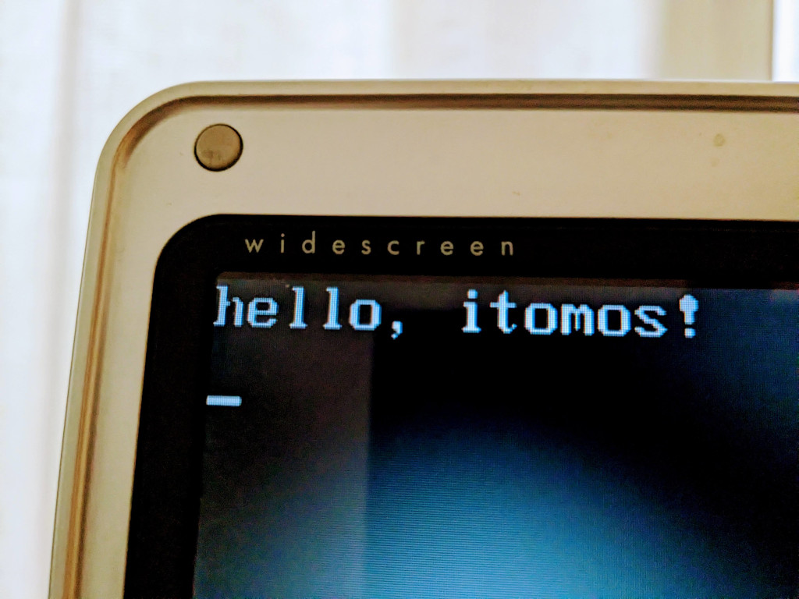

# itomos
An operating system

## STATUS:
Studying with passion! φ(●｀ε´●)

### 2023-03-10 hello, itomos!

Write code (boot.asm) and run commands below.

`$ nasm boot.asm -f bin -o boot.bin`

`$ dd if=/dev/zero of=floppy.img bs=1024 count=1440`

`$ dd if=boot.bin of=floppy.img seek=0 count=1 conv=notrunc`

`$ mkdir iso`

`$ cp floppy.img iso/`

`$ genisoimage -quiet -V 'itomos' -input-charset iso8859-1 -o itomos.iso -b floppy.img -hide floppy.img iso/`

`$ brasero &`

Burn itomos.iso to DVD-RW media.

Insert media into my old pc (HP compaq nx4820) and setup BIOS Boot Menu to '2. ATAPI CD-ROM Drive' and run!

Yaaa!

