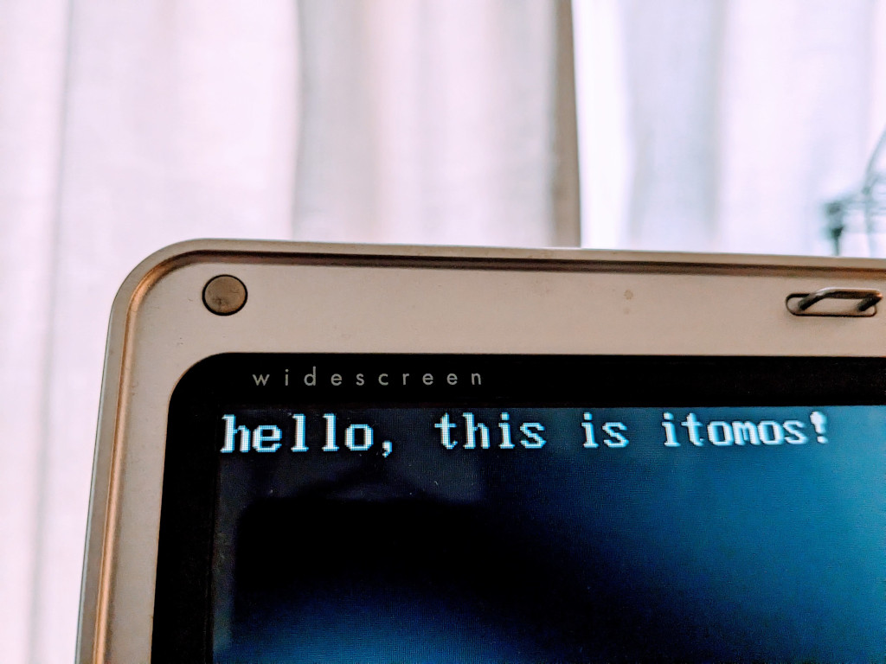

# itomos
An operating system

### STATUS:
Studying with passion! φ(●｀ε´●)

## 2023-03-28 hello, this is itomos!

hello from kernel.

`$ make`

`$ dd if=/dev/zero of=floppy.img bs=512 count=2880`

`$ dd if=itomos.bin of=floppy.img conv=notrunc`

`$ mkdir iso`

`$ cp floppy.img iso/`

`$ genisoimage -quiet -V 'itomos' -input-charset iso8859-1 -o itomos.iso -b floppy.img -hide floppy.img iso/`

`$ brasero`

Burn itomos.iso to DVD-RW media.

Insert media into my old pc (HP compaq nx4820) and setup BIOS Boot Menu to '2. ATAPI CD-ROM Drive' and run!

Yaaaa!

## Reference Site

- [Babystep1 - OSDev Wiki](https://wiki.osdev.org/Babystep1)
- [cfenollosa/os-tutorial: How to create an OS from scratch](https://github.com/cfenollosa/os-tutorial)
- [Writing My Own Boot Loader - DEV Community](https://dev.to/frosnerd/writing-my-own-boot-loader-3mld)
- [50 Lines of Code: Writing an x86 "Hello world" bootloader with assembly](https://50linesofco.de/post/2018-02-28-writing-an-x86-hello-world-bootloader-with-assembly)
- [linux - Creating a bootable ISO image with custom bootloader - Stack Overflow](https://stackoverflow.com/questions/34268518/creating-a-bootable-iso-image-with-custom-bootloader)
- [Call C kernel from assembly bootloader - Stack Overflow](https://stackoverflow.com/questions/27051471/call-c-kernel-from-assembly-bootloader)
- [General purpose registers in 8086 microprocessor - GeeksforGeeks](https://www.geeksforgeeks.org/general-purpose-registers-8086-microprocessor/)
- [CPU Registers x86 - OSDev Wiki](https://wiki.osdev.org/CPU_Registers_x86)
